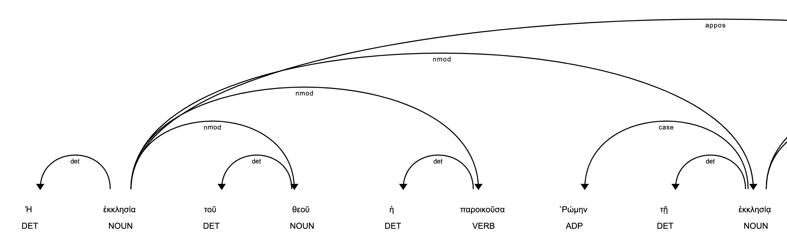

# Patristics on Natural Language Processing - Exploring I Clement with spaCy

Testing odyCy, spaCy and displacy the firts Letter of Clement with NLP

[OdyCy](https://centre-for-humanities-computing.github.io/odyCy/) is a Natural Language Processing library in python for Ancient Greek, capable of part-of-speech tagging, morphological analysis, dependency parsing, lemmatization and more.  It is based on the popular [spaCy](https://spacy.io/) framework, which makes odyCy easy to use, scalable, reliable and modular.

## Overview and Purpose

This notebook is simply an initial exploration of Hugging Face transformers - specifically NLP models, trained on Greek litterature, and applied to a piece of I Clement, in order to explore what's available.

## Where's the output and found results

Here: https://github.com/ronanguilloux/I-Clement-on-spacy/blob/main/Clement-I.ipynb

## Text Context

For this analysis, I used the [original Greek text of Clement I](https://ccel.org/ccel/lake/fathers2/fathers2.ii.i.html).
The `data` folder contains an excerpt and the full version as well.  

## How to get started

1. clone repository with:
```bash
git clone https://github.com/ronanguilloux/Patristics-I-Clement-on-spacy.git
```
2. Install dependencies with:
```bash
pip install -r requirements.txt
```
3. Run the jupyter notebook
```bash
jupyter notebook
````

## Notebook Usage

Jupyter Notebooks were used for initial exploration and investigation

## Example Output

See below for an example image output for the Tokens dependency parse visualization.


